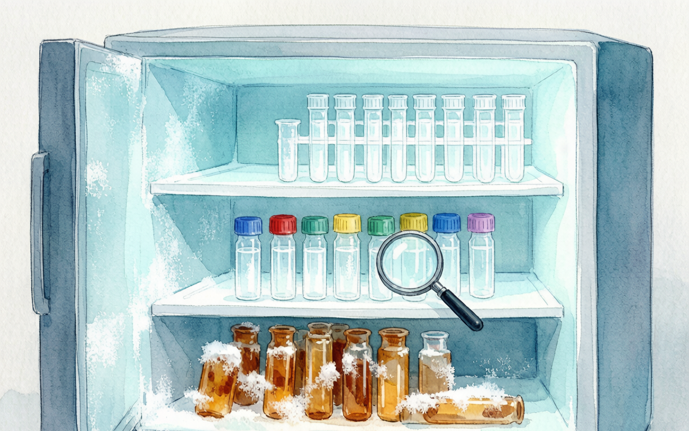

# 冰箱考古学：−20 °C里的时间胶囊

> 主题：实验室日常 | 关联：试剂存储产品 | 字数：约1100字

---

每个实验室都有一台这样的冰箱。

打开门，迎面一股白雾。等雾气散去，眼前的景象堪比考古现场：最底层躺着2019年的某管"不知道是什么"，中间层挤满了记号笔字迹已经模糊的冻存管，最里面还藏着半管抗体，标签上只写了一个字母G。

没有人知道G代表什么。问师兄，师兄说他来的时候就在了。

## 冰箱里的时间胶囊

实验室冰箱有一种神奇的引力。东西放进去就很难再出来。每过一段时间，冰箱里的内容物就会自发增加，直到塞得关不上门。

这个过程和考古地层形成有点像。最底层是建室初期的遗存，中间层是历届研究生留下的痕迹，最表层才是最近放进去的。如果从下往上翻，基本能还原出这个实验室近五年的研究方向变迁。

冰箱考古学的第一个发现：标签是科研文明的基础设施。

但现实是，很多实验室的标签系统接近崩溃。记号笔写的字在霜冻中脱落，贴的标签纸被冷凝水泡烂，有些管子上干脆什么都没写。放进去的人可能觉得自己能记住，三个月后他就忘了。

## 为什么抗体总是不灵

抗体保存是最常出问题的环节之一。

很多抗体说明书写着 Store at −20 °C，但没有人告诉你，−20 °C 的冰箱每天开关 50 次，实际温度在 −15 °C 到 −25 °C 之间波动。每次开门，冷凝水就在管壁上凝结，温度回升又重新冻结。反复冻融对蛋白质结构的破坏是累积性的。

一支抗体反复冻融 5 次以上，活性可能下降 30% 到 50%。到第 10 次，可能就只剩背景噪音了。

所以拿到新抗体时的标准操作应该是：分装。按每次用量分装到小管里，标记好名称、货号、日期和浓度，放到 −20 °C。使用时取一管，用完即弃，避免反复冻融。

这个道理人人都知道，但真正做到的实验室大概只有一半。另一半的抗体，正在冰箱深处默默失活。

## 冰箱整理：一场迟到的修行

冰箱整理这件事，和写毕业论文一样，大家都知道该做，但总在最后一刻才动手。

比较可行的方式是每季度做一次冰箱审计。不需要大动干戈，只需要做三件事。

**清标签。** 把所有管子拿出来，能辨认的重新贴标签，不能辨认的单独放一盒，标记"待确认"。两周后如果还是没人认领，就可以清理了。

**建清单。** 用Excel或实验室管理软件建一个简单的库存表：名称、货号、位置、存放日期、用量。这份清单贴在冰箱门上，每次取用登记。

**分温度区。** 冰箱不同位置温度不同。上层温度偏高，适合放缓冲液、培养基这类对温度波动不敏感的物品。中下层温度更稳定，适合放抗体、酶类等对温度敏感的试剂。门架位置温度波动最大，尽量不要放贵重试剂。

## 从考古到管理

冰箱整理的本质是实验室管理。一个管理良好的冰箱，背后是一个运转良好的实验室。

有些实验室会设一个冰箱管理员的岗位，通常由低年级研究生担任，职责是每季度组织一次整理、维护库存清单、监督标签规范。这个岗位听起来不起眼，但它可能是实验室里最有存在感的岗位之一。因为所有人都依赖冰箱，而冰箱的秩序取决于这个人。

说到底，冰箱里放的不只是试剂，是实验的可重复性，是课题组的时间线，也是每个科研人的心理状态。打开冰箱，一目了然，心里就踏实了。打开冰箱，一片混乱，做实验的力气就泄了一半。

小编刚进实验室那年，师姐带着我们整理冰箱，翻出过一支十年前的冻存管，标签早已看不清，但谁也不敢随便扔——万一是什么重要的中间品呢？这些年毕业了好几代学生，走的时候谁也没记得清理自己的"遗产"，等到我们这一级，冰箱已经塞得关不上门了。

冰箱考古的尽头不是考古，是传承——只不过传下来的不是经验，是一管管没人敢动的"文物"。

你还有什么关于实验室冰箱的有趣回忆吗？欢迎留言，看看谁家的冰箱才是真正的"时间胶囊"。

下次打开冰箱的时候，花五分钟看看里面。也许该清理了。

---

天放生物 | 品质可靠的生物试剂与专业的实验支持

抗体、试剂、耗材，来源可追溯，存储有规范

libereal.cn
