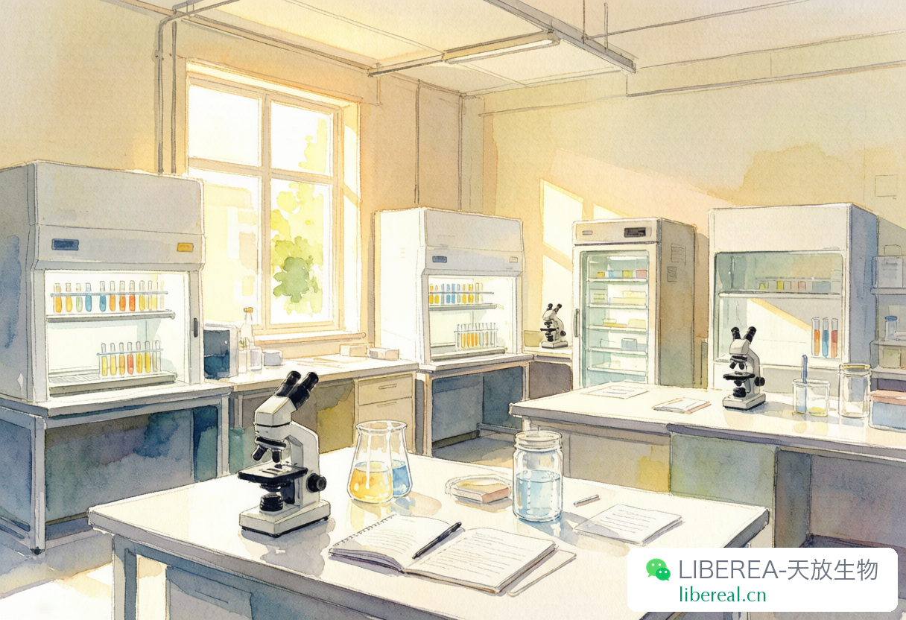

# 暑假实验室：趁没人打扰做长周期实验

> 摘要：科研人的暑假生活，就像小时候的暑假作业

---

七月中旬，实验室突然就安静了。

师兄去开会，师姐回老家，隔壁组那个老借移液枪不还的同学也不见了。整层楼就剩空调嗡嗡响，偶尔培养箱二氧化碳报警"嘀"一声。

有人觉得暑假无聊，我倒觉得这是做实验最好的时候。不是因为凉快——实验室空调从来没正常过——是因为没人。没人借你东西，没人跟你抢仪器，没人在你跑胶的时候凑过来问"你这条带是不是歪了"。

## 平时做不了的长周期实验，终于能排上了

最让人头疼的就是那些要连续观察好几天的东西。细胞迁移要拍 48 小时，药物处理得隔天取样，有些代谢实验跑一周都不止。平时工作日实验室人来人往的，培养箱被开开关关，超净台排不开，中间随便被打断一下就得重来。

暑假就不一样了。培养箱是你的，超净台也是你的，整个实验室都是你的。时间线自己说了算，不用跟谁协调。那些平时因为"排不上"一直搁置的实验，总算有着落了。

之前有个博士师兄说过，他整个课题最关键的那组数据，就是暑假一个人蹲出来的。连续五天，每天同一个时间点取样，中间一分钟没断过。工作日根本做不到——总有组会，总有课，总有人敲门找你借试剂。

## 开始之前先想清楚

做长周期实验最怕做到一半发现东西没备齐。所以开始之前有几件事得提前弄好。

时间线先画出来。不是大概记脑子里那种，是写在纸上或者手机备忘录里。几点取样、几点换液、几点拍照，全部标清楚。一个人值班的时候没有师兄提醒你"该去看了"，全靠自己盯着。

试剂耗材提前盘点。暑假供应商也放假，发货比平时慢。培养基够不够、胰酶还有多少、tip 头还剩几盒，开始之前数一遍。不够的提前在 libereal.cn 上下好询价单，假期前到货最稳。跑到一半发现没东西了真的很崩溃。

还有就是应急预案。细胞污染了咋办，培养箱报警了咋办，突然断电了咋办。实验室负责人的电话贴在显眼的地方，知道备用 CO₂ 钢瓶在哪，知道冰箱断电后哪些东西必须马上转移。一个人在实验室，最怕的不是实验做不出来，是出了状况不知道该找谁。

## 一个人值班的日常

暑假实验室最大的敌人其实不是实验，是自己的惰性。

没有组会的压力，导师也不怎么来，自律就变得特别重要。我自己的办法是排个时间表，几点到、几点取样、几点记数据、几点吃饭，虽然听起来很死板，但一个人值班的时候没有时间表，很容易就从"今天放松一下"变成"这周好像啥也没干"。

数据记录要格外认真。一个人做的实验，记潦草了事后没人帮你想起来。时间、条件、观察到的现象，每一步都写清楚，能拍照的拍照。这些记录等开学整理数据的时候会救你一命。

安全这个事不想啰嗦但必须说。用到有毒试剂或者高压灭菌的时候，至少告诉一个人你在干嘛、大概几点弄完。实验室安全从来不是一个人的事。

## 暑假做实验的额外收获

暑假一个人待在实验室，除了拿到数据，还会有些别的东西。

你会更了解自己的实验。平时习惯了依赖师兄师姐的判断，暑假只能自己查文献、自己找问题。很多平时糊里糊涂过去的细节，被迫自己想清楚之后，整个课题的思路会顺畅很多。

你也会更了解实验室本身。一个人待久了就会发现，培养箱哪一层的温度最均匀，哪个超净台风最稳，哪台显微镜对焦最舒服。这些细节平时都被吵吵闹闹盖住了，暑假自己就冒出来了。

当然你也会更想那些平时烦你的人。凌晨一点一个人给细胞换液的时候，突然就理解了师兄那句"做实验还是得有人一起"。

暑假过半了，实验室马上又要热闹起来。趁现在还安静，把那些想做没空做的实验推一推。说不定开学回来，你的课题就往前迈了一大步。

你暑假在实验室待过最久的一次是多久？有没有一个人值班时候的有趣经历，留言聊聊呗。

---

撰稿：24级分子生物学-噜噜 | 编辑：Sea | 校对：Peter

天放生物 | 品质可靠的生物试剂与专业的实验支持

试剂、耗材、培养基，暑假备货记得提前询价

libereal.cn
