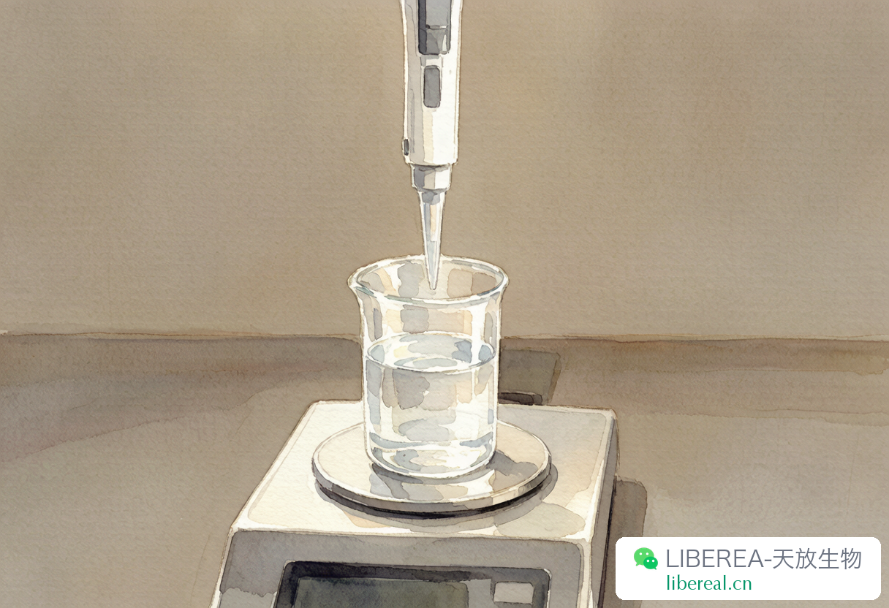
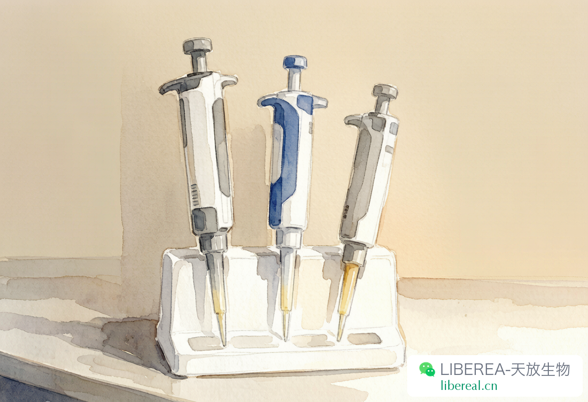

# 移液枪校准日：实验室最被忽视的仪式

> 主题：实验室日常 | 关联：Labselect 耗材 | 字数：约1100字

---

每个实验室大概都有一把"祖传"的移液枪。

这话我在好几个实验室都听过。服役八年十年的，枪头松了插上 tip 就漏液，刻度旋钮阻尼忽大忽小，但每个人用完还是放回原位，从来没人提过送它去校准。

你要问起来，回答基本都一样："还能用啊。"

干我们售后这行的，听到"还能用"三个字就头疼。它基本等于"我也不确定准不准，但凑合着用"。

## 枪不准，实验真的白做

移液枪大概是实验室里用得最频繁的东西了。一天吸液上百次，配缓冲液、稀释抗体、铺细胞、加样跑 PCR，全靠它。每次吸液其实都在积累误差，只不过你看不见。

吸出来的液体看起来跟昨天没区别，但实际体积可能已经偏了 5%、8% 甚至更多。这个偏差当天发现不了，等你重复实验怎么都复现不出来的时候，才会慢慢意识到不对劲。

说真的，我每年接手的"实验复现不出来"的求助，十有八九最后查下来跟移液器有关。去年有个课题组做 ELISA，标准曲线连续三周画不好，复孔间变异系数飙到 15% 以上。他们换试剂、换操作人、换孵育时间，折腾一圈没解决。送到我们这边一测，那把 P200 弹簧老化，实际吸液量比刻度值少了 12 微升。换了把校准过的枪，曲线立马就漂亮了。

三周时间，三个人的人力，搭在了一把没校准的移液枪上面。这种账算下来真挺亏的。

## 重量法：自己就能做的校准

校准移液枪不用送专业机构，实验室自己就能搞。最靠谱的方法是重量法。

原理不复杂：水的密度是已知的，室温下大概 0.998 g/mL，用分析天平称一下吸出来的水有多重，反推实际体积就行。

操作也不算麻烦。准备一台万分位天平（精度 0.1 mg 那种）、一管室温平衡过的超纯水、一个小称量杯。

设好量程，润洗 tip 三次。吸液的时候垂直插进液面，别太深，两三毫米够了。匀速慢慢吸，吸完停两秒让液面稳住。然后把液体打到称量杯里，称重。重复个十次，取平均值，算一下实际体积和变异系数。

合格标准我一般这么定：体积误差不超过标称值的 ±2%，变异系数不超过 1%。不同量程会有些区别，大体积允许误差小一些。说实话这个标准不算严，但实验室自检够用了。

整个过程也就半小时的事。半年做一次，基本能保证枪的精度在靠谱范围内。不是我较真，是数据这东西你不盯它，它就敢飘给你看。

## 日常用枪的几个习惯

校准是出了问题再补救，平时的使用习惯才是根本。这几个习惯保持好的话，枪的精度寿命能长不少。

吸液的时候要垂直。倾斜着吸会偏大，尤其是大体积的枪。养成垂直插液面的习惯，偏差能小一半——这个我们测过，不是瞎说。

换新 tip 之后先吸排两三次再正式用。这叫润洗，让 tip 内壁形成一层液膜。不润洗的话第一次吸液会偏小，因为有一部分液体沾在干壁上了。

千万别拿移液枪当搅拌棒用。去搅溶液很容易让液体倒吸进枪体，腐蚀活塞。活塞一旦生锈，精度就彻底废了，修都修不回来。每年我们送修的枪，三成是这么坏的。

还有一个小习惯，用完枪之后把量程调到最大。这样弹簧是放松的状态，不容易疲劳。坚持半年你就会发现自己那把枪比实验室别人的明显准。

## 什么时候该送修

重量法校准如果发现偏差超过 5%，怎么调零都拉不回来，那基本是内部零件有问题了。这种情况就别硬调了，送修。

平时用的时候如果感觉阻尼突然变了，或者吸液的时候有气泡，或者排完液 tip 里总剩着一点，这些都是该检修的信号。

移液枪说到底是消耗品，不是传家宝。一把枪用十年不修不校准，这不是省钱，是拿实验的可靠性在赌。我们组这些年见过太多"赌输了"的案例，最后都是数据报废、实验重做。

下次进实验室，花个十分钟给常用的那把枪做一次重量法校准。做完之后你会对自己的数据更有底气。

你们实验室的枪多久校准一次？有没有因为枪不准踩过坑的，留言说说。

---

撰稿：售后-陈工 | 编辑：Sea | 校对：Peter

移液枪、tip 头、实验耗材，Labselect 品质稳定

libereal.cn
