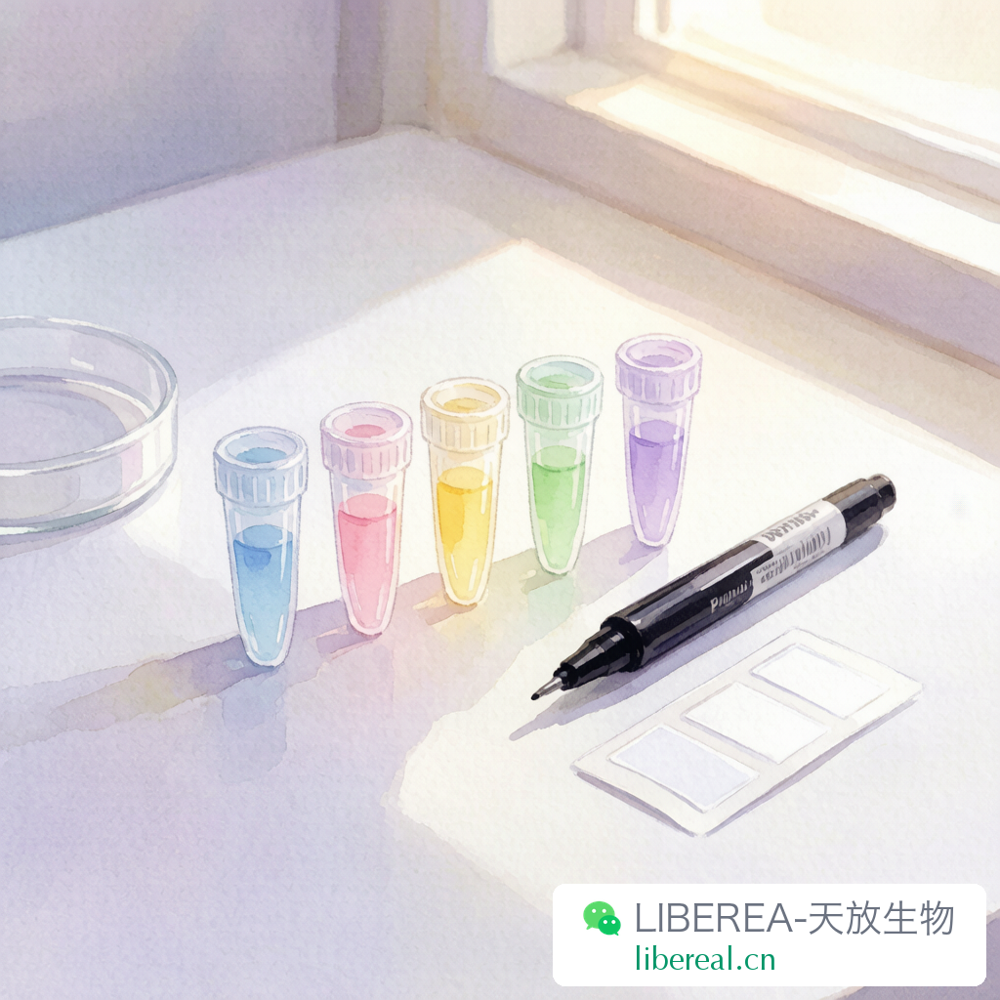
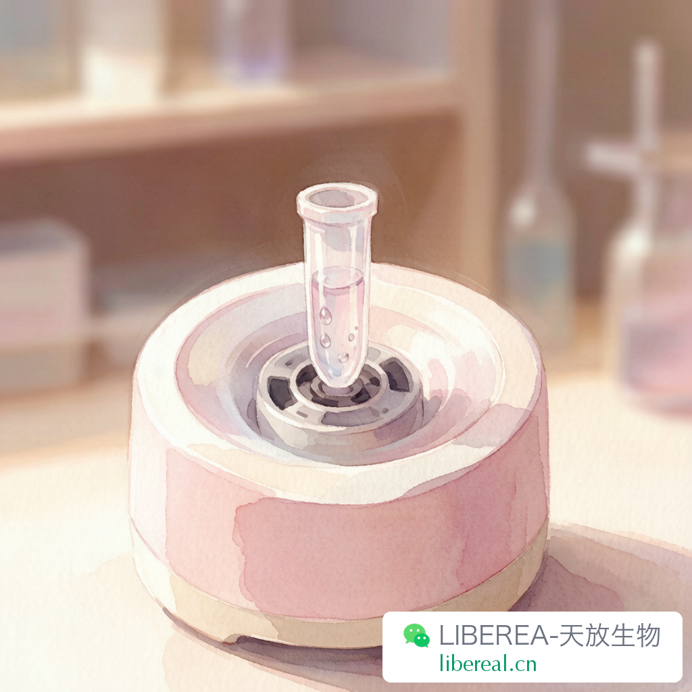

# 抗体保存的六个误区，第三个几乎人人都踩过

> 主题：试剂冷知识 | 关联：抗体产品线 | 字数：约1100字

---

干试剂组这些年，我经手的抗体少说也有几万支。说实话，抗体大概是实验室里单价最高、又最容易被「随便放放」的试剂了。一支进口单抗好几千，多克隆也要大几百，保存不当活性掉了，实验做不出来，钱也白花了。

今天说几个常见的保存误区。有些看起来是小事，但踩过坑的人都知道，抗体一旦出问题，排查起来最头疼。

## 误区一：所有抗体都得放 −20 °C

不是。很多抗体说明书写着 Store at 4 °C，你就真把它放进 −20 °C，反而可能坏事。

抗体能不能冻，关键看有没有甘油。含甘油的抗体（比如很多市售单抗是 50% 甘油/PBS 配方），−20 °C 不会结冰，可以长期冻存。但不含甘油的抗体，4 °C 短期存放就行，反复冻融才是大敌。有些酶标抗体、荧光标记抗体，冻一次标记物就脱落一半，放 4 °C 反而稳。

我的建议是：收到货先看说明书，按厂家写的来。没写清楚的就默认 4 °C 短期、−20 °C 长期分装冻存，别自己发挥。

## 误区二：反复冻融几次没事

有事，而且事不小。

蛋白质每次冻融都是一次结构应力测试。冰晶形成会刺破蛋白构象，解冻后有些抗体就再也复性不回来了。一支抗体冻融三次，活性掉个两三成是常态。冻融十次以上，基本只剩背景了。

所以分装是必选项，不是可选项。拿到新抗体，按每次用量分装到 20 μL 或者 50 μL 的小管里，写好名字、货号、日期、浓度，冻起来。用的时候拿一管，用完扔掉，主 stock 再也不动。这个习惯养成之后，你的抗体寿命至少翻倍。

## 误区三：标签随便写写就行

这个误区我见过太多次，而且几乎人人都会犯。

标签上只写 "CD3" 或者 "Actin"，连单抗多抗都不分，更不写货号和日期。半年之后谁都不知道这管是什么，只能重新买。还有些用铅笔写、用水性记号笔写，−20 °C 里一待，字迹糊成一片，跟没写一样。

我们库房的标准是：标签必须包含四项——名称、货号、分装日期、浓度/稀释比。用防酒精记号笔写，贴耐低温标签纸。如果条件有限，至少把货号写清楚，凭货号就能查回来一切信息。

标签是保存的一部分。标签废了，等于试剂废了。

## 误区四：收到快递直接扔冰箱

抗体经过一路运输，管壁上可能挂了不少液滴。收到之后最好离心一下，把液体甩到管底再开盖。不然一开盖，液滴溅到管口或者盖子上，下次用的时候污染风险很大。

尤其是那种带荧光标记的抗体，液体挂壁之后开盖，标记物见光分解，活性直接打折。这个步骤就一分钟，别省。

## 误区五：过期了也能凑合用

抗体的效期不是厂家随便印的。过了效期不代表立刻失效，但厂家不再保证性能。做预实验可以，但正式数据最好别赌。

我们库房每季度会扫一次效期，临近六个月的标黄提醒，临近三个月的标红优先用或者报废。这个制度听起来麻烦，但真到做实验的时候，你不会想怀疑「是不是抗体太老了所以没条带」。排除一个变量是一个变量。

## 误区六：一种保存条件适合所有

多抗和单抗不一样，标记抗体和未标记的不一样，不同厂家的配方也不一样。有些抗体加叠氮钠防腐，有些没有；有些要求避免反复冻融，有些反而建议分装后冻存。

最靠谱的做法是建立一张自己的抗体保存表。名称、货号、来源、保存条件、效期、位置，用 Excel 或者实验室管理软件记下来。团队共享，谁用了登记，这样不会重复采购，也不会放到过期都没人知道。

说到底，抗体保存没有玄学，就是三个原则：温度对、不分装不反复冻融、标签清楚。做到这三点，大部分问题都能避免。

你实验室的抗体是怎么保存的？有没有因为保存不当导致实验翻车的经历？留言说说，大家一起避雷。

---

撰稿：试剂组-老周 | 编辑：Sea | 校对：Peter

抗体、试剂、耗材，品质可靠，来源可追溯

libereal.cn
