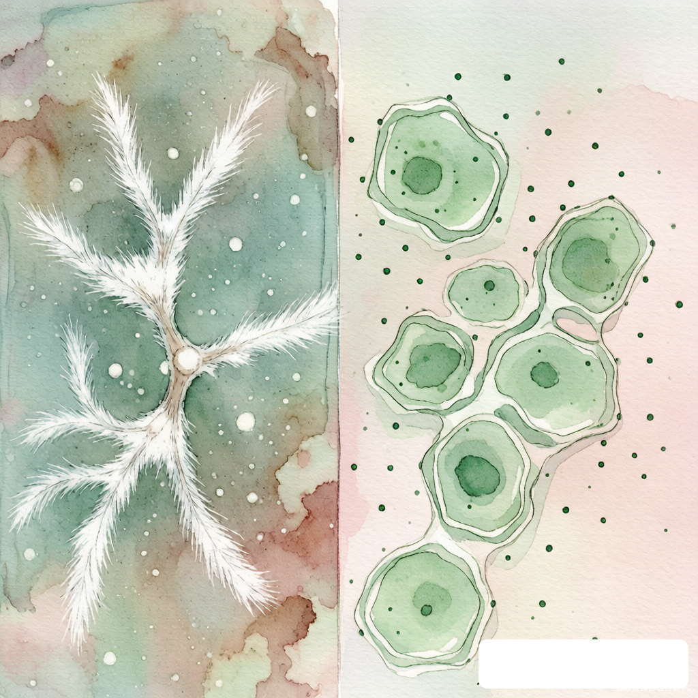
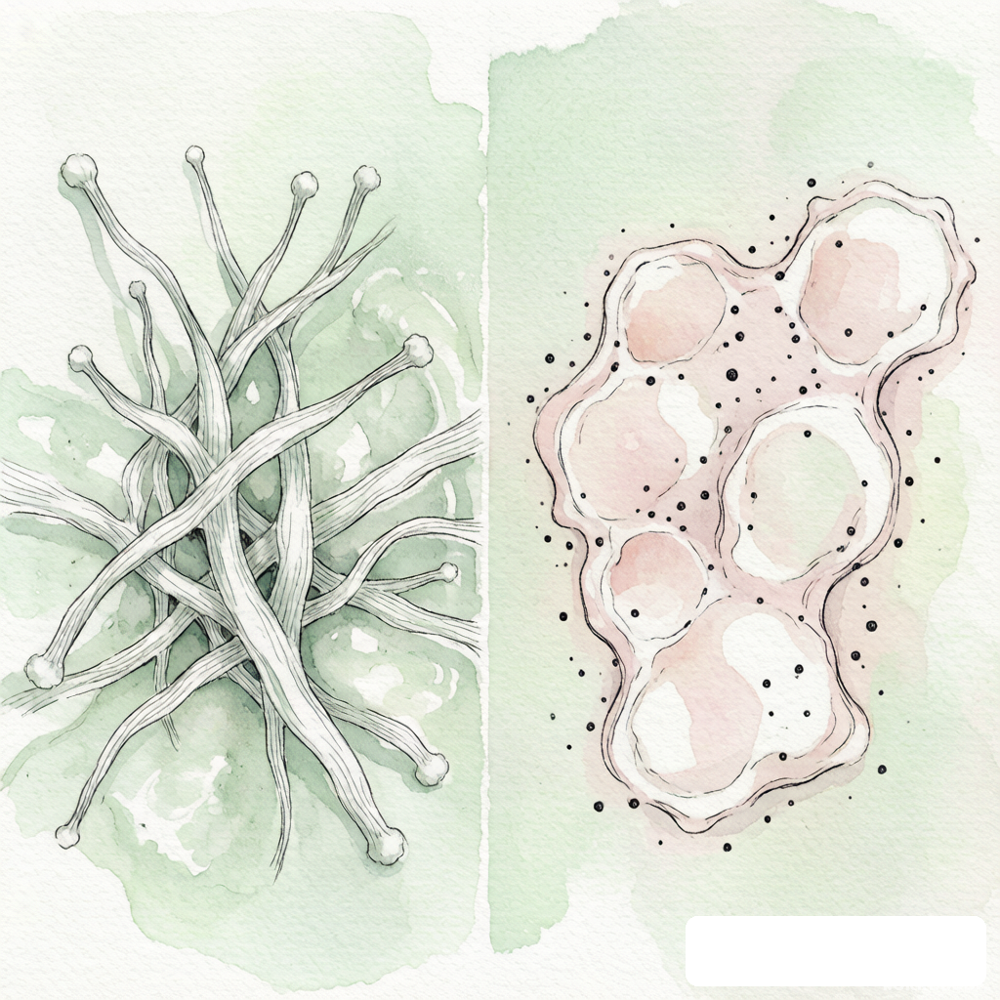

# 细胞培养污染鉴定图鉴：细菌真菌支原体一图分清

> 摘要：培养基突然变浑不一定都是细菌，细胞长得慢也不一定是你手潮。

---

做技术支持这些年，接到的细胞培养求助里，十通电话有六通最后都指向同一个结论：污染了。

但有意思的是，很多打电话来的人开口就说"我细胞被细菌污染了"，真问到看见了什么，描述却五花八门。培养基变黄、飘着小白点、细胞状态差、背景脏……这些症状背后可能是细菌、真菌、支原体，甚至只是培养基批间差。一上来就定性，很容易把实验带偏。

今天就按我们售后和实验室对接的经验，把三种最常见的污染摊开讲一遍。认清楚敌人，才能决定是救还是扔。

## 细菌污染：来得快，看得清

细菌污染最典型，也最好认。

通常半天到一天就能看出来。培养基从粉红变成黄色或橙黄色，浑浊得像放了酵母的温水，有时候还能看到细小颗粒在液体里游动。显微镜下低倍镜就能看到小黑点，高倍镜下形态比较规则，杆状、球状或者螺旋状，会做布朗运动或者主动游动。严重的时候，细胞状态断崖式下跌，贴壁细胞变圆、漂起来，好像一夜之间就被"团灭"了。

细菌污染的源头多半在操作环节。吸液管、tip 头灭菌不彻底，超净台滤网该换没换，或者手套碰到了瓶口边缘，都是常见原因。我们见过最离谱的一次，是实验室的 PBS 瓶子放在台面上被空调水滴进去，整批细胞三天内全军覆没。

处理办法就是别救，直接扔。细胞、培养基、用过的 tip 头全部按生物危害废物处理，培养箱和超净台彻底消毒。想留种的话，同期冻存的细胞也要谨慎评估，最好重新复苏一支。

## 真菌污染：慢热型选手，最容易被忽略

真菌污染比细菌慢，但更难缠。

初期可能只是培养基里出现几个小白点，像碎纸屑或者小棉絮。细胞状态下降得不明显，很多人第一反应是"培养基里怎么有沉淀"，不当回事。过两三天再看，白点开始拉丝、分叉，长成菌丝，这时候已经很明显是霉菌或者酵母了。显微镜下能看到丝状结构或者出芽的酵母细胞，和细胞的边界很清楚。

真菌孢子轻，飘得远。一旦实验室有一瓶长了霉，周围几个培养箱都要提高警惕。我们处理过一个案例，细胞房通风口附近的一盆绿萝长了霉菌，孢子通过气流进了培养箱，整层楼的细胞断断续续污染了一个月才找到源头。

真菌污染同样建议直接弃掉。培养箱要用含抗真菌成分的消毒液彻底擦拭，加湿器水槽也要清洁。真菌孢子抵抗力比细菌强，简单喷点酒精不一定杀得死。

## 支原体污染：隐形的实验杀手

支原体是最麻烦的一种，因为通常你看不见。

培养基颜色不一定变，细胞也不一定会立刻漂起来。常见表现是细胞增殖变慢、状态变差、转染效率下降、诱导分化做不出来，但你说具体哪里不对，又说不上来。很多课题组在这些"玄学"症状上折腾了好几个月，换培养基、换血清、换操作人，最后才想到查支原体。

检测支原体的常用方法有几种。PCR 法最快，灵敏度高，适合定期筛查。荧光染色法（比如 Hoechst 33258）可以看到细胞核周围的微小荧光点，但需要经验判断。培养法最准，但周期长，要几个星期。我们一般建议课题组每三个月做一次支原体普查，尤其是细胞房共用的细胞系。

支原体污染的处理更棘手。支原体没有细胞壁，普通抗生素比如青霉素、链霉素对它无效。市面上有一些专门针对支原体的清除试剂，但效果不稳定，而且容易复发。如果这株细胞特别重要，可以试试清除加连续检测；如果不是很关键，最省事的办法还是重新引入一株确认干净的细胞。

## 预防比鉴定更重要

说到底，污染发生后再怎么鉴定，都已经付出了时间成本。日常把几个方面盯紧，能少踩很多坑。

首先是人。进细胞房前换鞋、穿实验服、戴手套这些老生常谈，真能做到位的实验室其实不多。其次是环境和设备。超净台滤网、培养箱水盘、加湿器都是高危区域，定期清洁和换水不能省。第三是试剂。血清批次差异、培养基开封时间太长、PBS 和胰酶反复取用，都是潜在污染源。最后一条，细胞不要到处串门。不同课题组共用细胞房时，各自的操作习惯和细胞背景不一样，交叉污染的风险会高很多。

我们组每年整理的细胞培养问题里，真正由试剂质量引起的比例并不高，大多数还是因为操作习惯和环境管理。换句话说，污染不是运气问题，是细节问题。

下次看到细胞状态不对，先别急着怪培养基，也别一上来就喊"细菌污染了"。对着上面这几条对一对，大概率能省下几瓶细胞和一两个星期的实验周期。

你们实验室有没有那种"明明看着没事，结果全军覆没"的细胞污染经历？是怎么最后找到源头的？评论区聊聊，大家一起排雷。

---

撰稿：技术支持-阿杰 | 编辑：Sea | 校对：Peter

天放生物 | 细胞培养试剂、培养基、耗材，品质稳定可溯源

libereal.cn
