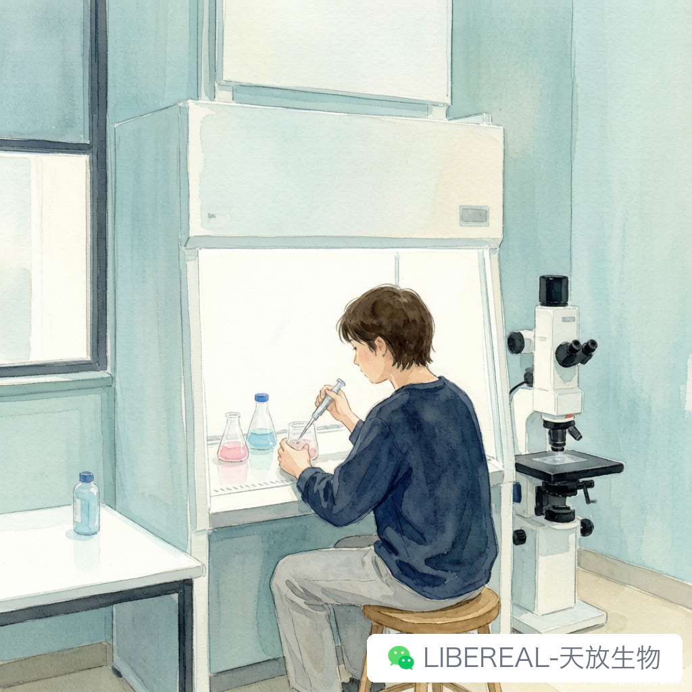

# 暑假值班排班术：细胞传代不能停怎么办

> 摘要：你可以放假，细胞不会跟着一起放。

---

研三最后一个暑假，实验室走得只剩三个人。走廊安静到能听见冰箱压缩机的声音，但我那几瓶细胞不管这些，该长还是长，两天不看就铺满，铺满了就得传。

于是每年这个时候，细胞房门口都会贴一张纸——值班排班表。看着简单，排起来门道不少。我从被排班的人变成排班的人，踩过的坑够写一篇了。

## 排班不是排人，是排细胞的生物钟

新手排班最容易犯的错，是先看谁有空，再决定哪天来。顺序反了。

正确做法是把在养的细胞列一遍，标清楚各自的传代频率。HEK293、HeLa 这种长得快的，两三天一次；原代细胞或慢生长的株，一周一次也够。把最短周期找出来，排班间隔就不能超过它，哪怕只是进去看一眼。

传代还不是唯一要做的事。换液、观察、加药、拍照，这些琐事加起来比传代本身还费时间。按"进一次细胞房至少一个半小时"算，比较接近现实。

## 交接比值班本身更重要

最怕的不是没人来，而是来的人不知道该干什么。

我们组现在的规矩是，谁的细胞谁写清单。走之前在共享文档里列明白：什么细胞、第几代、什么培养基、多久要传、有没有加药。培养瓶标签也得重写一遍，别指望值班的人认识你那个只有自己看得懂的缩写。

我研一那年替师兄值班，他只说了句"帮我看看细胞"就走了。我进去发现四个培养瓶，标签全是英文缩写，配的培养基还不一样。不好意思打电话，就凭感觉传了。结果传错两瓶，师兄回来查了一个星期才发现问题出在我这儿。

那之后我就养成了写清单的习惯。清单不是给别人看的，是给三天后忘了自己在干嘛的自己看的。

## 走之前要盘的东西，比想象中多

暑假最难受的不是累，是缺东西。

学校快递不一定照常收，供应商也可能放假。半夜发现胰酶见底，第二天补不上，细胞就只能干等。所以放假前一定要盘库存：培养基、血清、胰酶、PBS、移液管、培养瓶，一样都不能漏。

盘的方法很土但有效——按最短传代周期乘以值班天数，算出总次数，再乘以每次用量，最后乘 1.5 当余量。看着浪费，但比断供强。

我们组一般在放假前两周就把补货清单交给采购。细胞培养这类基础试剂用量稳定，提前备着不会浪费，libereal.cn 能查现货和批次，暑期补货会省事一些。

## 意外预案：写在纸上，贴在门上

暑假值班最怕突发状况，而突发状况最爱挑没人的时候来。

CO2 钢瓶用完、培养箱故障、实验楼检修、门禁刷不开卡……这些我都遇见过。所以细胞房门后贴着一张纸，写了物业维修、气体供应商、实验室安全员和组里住得近的两个人的电话。纸质版，因为断电时手机不一定有信号，网也可能连不上。

再补一条：值班的人如果发现某瓶细胞不对劲，别一个人纠结。先单独隔离出来，拍张照发群里。有的师兄师姐一看照片就能判断个大概。

写这些的时候我正在收拾工位。研三了，这大概是我最后一次排暑假的班。

想想有点好笑，读研这几年跟我相处时间最长的，可能不是室友也不是同门，是那几瓶细胞。等到毕业交接完，倒还真有点舍不得。

你们组暑假排班是怎么弄的，有没有那种一到假期就自动消失、排班表上永远找不到名字的同门。评论区见。

---

撰稿：23级细胞生物学-栗子 | 编辑：Sea | 校对：Peter

天放生物 | 细胞培养基、血清、耗材，暑期备货稳定供应

libereal.cn
