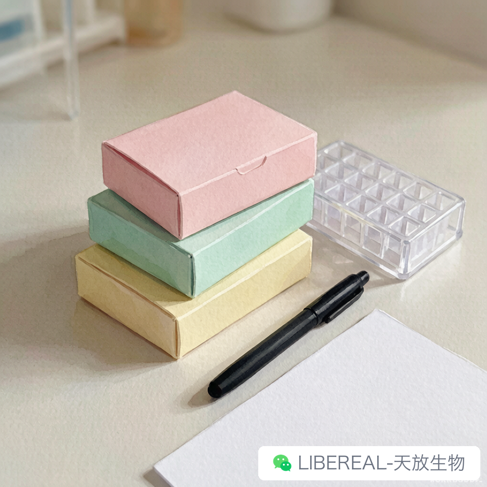

# 暑假试剂盘点：哪些该补货，哪些少囤

> 摘要：盘一半靠猜是常态，但这行干久了，眼睛和 Excel 都得修炼。

---

做采购这些年，暑假前是最忙的窗口，比年底结算前还忙。学校的快递要查、供应商要问、冷链要协调，老师们发过来的补货清单常常和现实差得有点远。

前几天一位 PI 给我发了个 Excel，38 行，整整齐齐。我点开一看，光二抗就列了五种型号、四个公司。我打电话过去问，他自己也说不清楚为啥要买这么多。

这种单子我最怕接。不是嫌麻烦，是知道最后大概率有七八项用不上，库存的位子就那么点，留着也是浪费。比起"啥都买"，暑假补货其实是个挺细的技术活。

## 先盘使用频率，再盘消耗量

很多老师上来就问"你们那XX抗体还有现货吗"，顺序其实是反的。

应该先把自己组最近三个月的消耗清单拉出来，按 SKU 排一排，看哪些是月月都要用的，哪些仨月用了不到两支。前面那一类铁定要补，后面那一类基本可以不动。

我用的土办法，是把试剂按"消耗速度"分成三档——快消品（培养基、tip 头、PBS）、稳态消耗（常用规格抗体、酶、引物）、慢销品（特殊标记试剂、即用型试剂盒、小众一抗）。

快消品囤多少按假期天数算。按"最短消耗周期 × 实际放假天数 × 单次用量 × 1.5 倍余量"这个公式，看着粗暴但这么多年没断过供。之前有人按精确到天的计划算，结果假期被临时叫回来加做实验，第三天就清空了。

稳态消耗主要是盯有效期。这部分库里常年都有滚动库存，暑假前补一个季度的量就够，多了占资金。我们自己库里有过教训，某款二抗一次补了 50 支，结果用了大半年还没用完，最后两支过期作废。

## 哪些千万别囤

这行干久了，除了耗材耐放遇到好价做活动可以多买点，试剂可不能"反正便宜，多买点"。

各个实验室情况不同。有些实验室方向课题比较多，各小组在实际使用上交叉并不多，这种情况有些东西真不能多囤。对于可共用的试剂可以适当囤货，最典型的是胰酶、TrypLE 这类含酶的溶液，反复冻融活性会掉，开封后稳定期也很短。这种试剂最适合开封后大家共用，很快就用完了。相反，有的实验室各小组课题不交叉就不适合多囤，要不然开封用了几次后到第二个月酶活就明显下降，做下来的细胞贴壁率比平时低两成。

引物也类似。外送的引物最好按需合成，库里没必要压货，自己分装冻存的稳定性可以；即用型试剂盒更别囤，离失效期太近或者运输一折腾，到手可能已经不合适了。

还有内切酶、连接酶这些，反复冻融是大忌，量大反而是负担。

冷链在夏天也容易翻车。我们自己发过的货里，暑期因为温度异常退货的批次有一半集中在七八月。所以补货发的时候得确认冷链包材到位，泡沫箱里冰袋没化、包装完整、记录仪数据可查。这一行其实没什么高深的学问，靠的就是把"按规矩办事"养成肌肉记忆。

每年 6 月底我们采购组会做一次暑期预测，把历史数据和 PI 申报对比一下，给个建议量。欢迎各单位的老师列个清单发邮件给我们，我们帮你汇总查清楚批次和有效期，省得您一个个打电话问。

暑假除了必要的试剂补充 2-3 个月的量，通常这段时期是耗材的大促期，各位 PI 老板可要注意大促优惠，错过等一年哦。

暑期补货这件事，宁可少而精，也别多而杂。

你们组暑假前是怎么盘库存的——靠 Excel，还是全凭脑子记得住。

---

撰稿：采购组-薅羊毛 | 编辑：Sea | 校对：Peter

天放生物 | 试剂现货批次透明，暑期冷链稳定发运

libereal.cn
