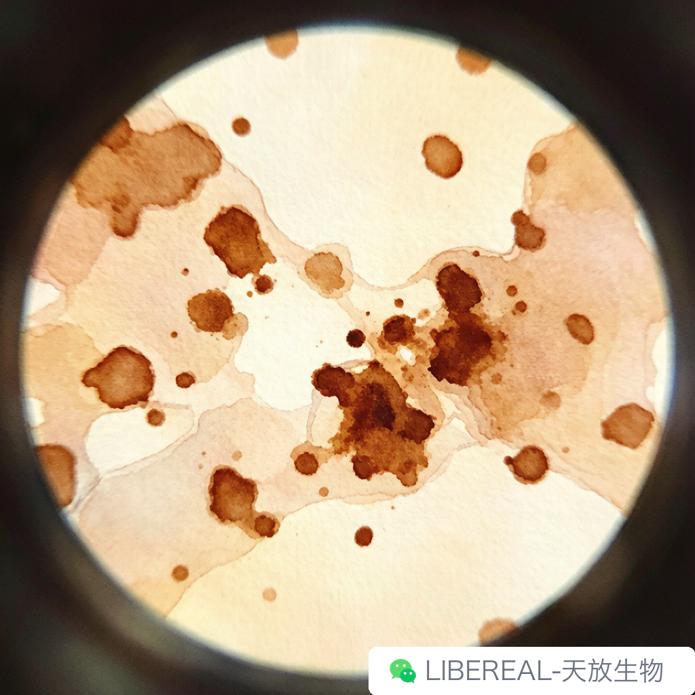
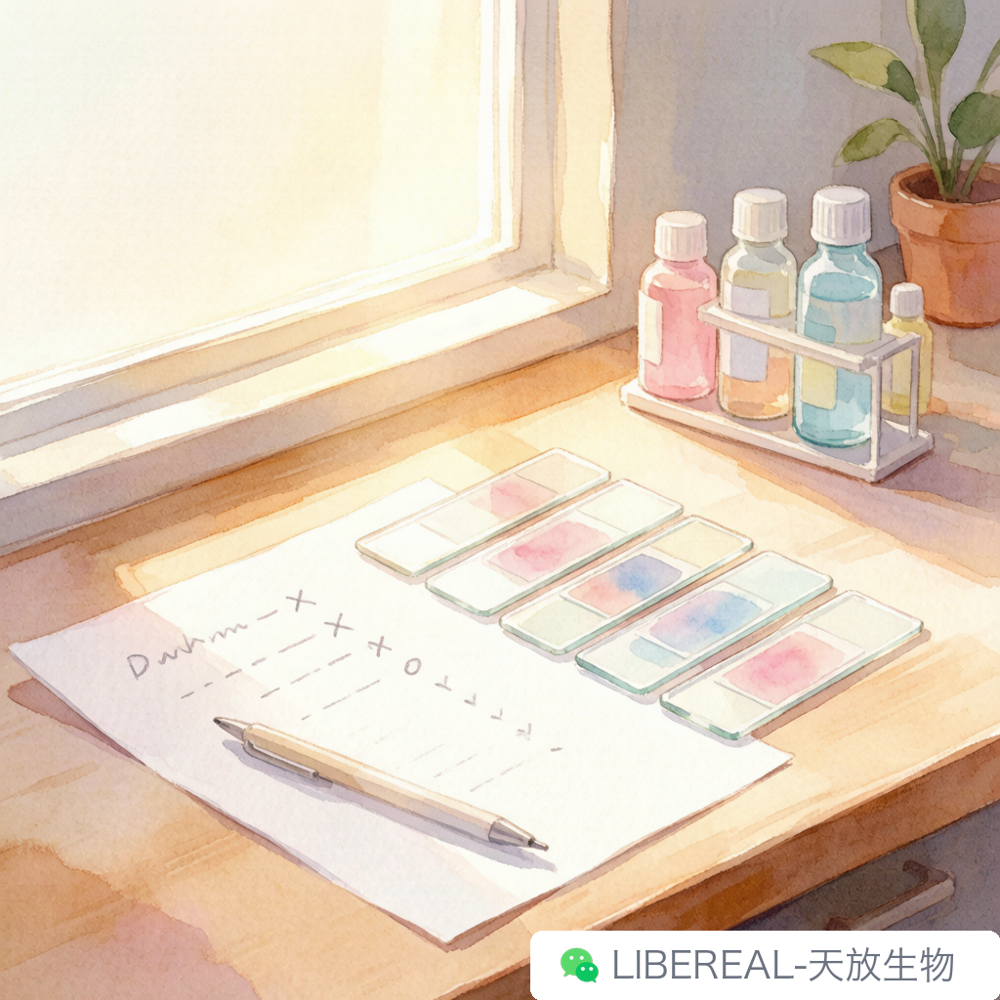

# IHC 染色背景脏？排查清单

> 摘要：背景脏不是运气差，是排查顺序没走对。

---

上周三下午，刚把水杯放桌上对话框就响了。对面是个新博士，开口第一句："片子又糊了，背景很脏，跟酱油泼上去似的，你帮我看看。"这种问询经常会遇到。IHC 背景脏，在我们售后收到的 IHC 求助里排第一，十个问询得有六七个是这个。

今天把常见的几条原因按排查顺序写出来，不是教科书，是这些年电话里一个个案例攒出来的经验。照着走一遍，比瞎换试剂管用。

## 一抗浓度是头号嫌疑

很多老师怕染不上，一上来就按说明书上限加，胆子大的直接翻倍。信号是有了，背景也跟着起飞。

说明书写 1:100 到 1:500 的，先试 1:250。之前有个客户一抗用了 1:50，背景深到组织形态都看不清，稀释到 1:200 以后干干净净，他还打电话来问是不是我们换了批次。没有，就是浓度太高了。

孵育时间也收着点。4度过夜是常规操作，但有的抗体 37度半小时就够，拖长了非特异结合反而多。每种抗体脾气不一样，真不能一套方案打天下。

## 封闭和洗涤，最容易被糊弄的两步

二抗交叉反应跟封闭直接相关。血清封闭时间不够、浓度偏低，二抗就到处乱挂。我们一般建议封闭至少半小时，用和二抗同源的血清——二抗是山羊抗兔，封闭就用山羊血清。图省事用 BSA 代替的，差挺多。BSA 能封蛋白位点，但拦不住二抗跟切片里内源性 IgG 结合，血清更全。

封闭液别回收，回收一次效价掉一截，背景上一个台阶，这步省不了钱。

洗涤是最被低估的环节，很多人压根没当回事。PBS 洗三次每次五分钟，摇床上晃着；手动洗的话换液时把片子在液面下涮几下，别光泡着。TBST 比 PBS 干净点，Tween-20 有脱脂作用，能带走松散结合的东西。

有回客户说背景脏，我问洗几次，对面沉默两秒："PBS 冲了一下。"得，问题就在这。

## 内源性酶和生物素

用 HRP 系统时，组织自带的过氧化物酶（红细胞、肝脏、肾脏里多）会跟 DAB 反应，整片背景发黄；内源性生物素会跟 avidin-biotin 系统结合，出假阳性。HRP 系统用 3% H2O2 室温十分钟灭活，ABC 系统用 avidin 和 biotin 分别封闭。现在不少实验室直接换聚合物二抗，绕开生物素，这步就省了。

判断技巧：背景是弥散性发黄而不是局灶性棕黄，先怀疑内源性酶，别急着怪抗体。

## 组织处理和切片，问题常在看不见的地方

固定不充分或者抗原修复过度，背景都会变差。固定不足组织形态维持不住，抗体渗到不该去的地方；固定过度更麻烦，抗原表位被交联剂封死，抗体结合不上，有的老师就加高一抗浓度来补偿——然后背景又炸了。这个恶性循环我见过太多次。

抗原修复条件按组织类型来。常规石蜡切片柠檬酸钠 pH 6.0 微波炉中火五分钟基本够，但肌肉、皮肤、致密结缔组织这些修复时间要加长。有的实验室所有切片统一修十分钟，脑子的片子背景干净，肠子就糊了。不同组织得分开试，这条真没有万能解。

切片太厚抗体渗透不均匀，3 到 4 微米比较标准。刀钝了有刀痕，折叠的地方抗体在折缝里堆积，看着像背景脏，其实是物理问题。裱片有气泡，抗体会在气泡边缘聚集，染出来一圈深。烤片别超 60度两小时够了，有的实验室 80度过夜，抗原都变性了能不乱吗。

## 排查顺序：一次只改一个变量

按这个顺序走：一抗浓度和孵育条件排最前，然后是封闭和洗涤，再查内源性酶，最后才看组织处理和切片质量，大部分问题这几步能锁定。

最重要的一点，每次只改一个变量。同时提高一抗、延长封闭、换洗涤液，最后背景好了也不知道是哪个改的。我们售后最头疼这种，因为同样的问题下次还会来，原因已经丢了。

IHC 说到底是个经验活，protocol 再细也得自己摸。libereal.cn 上抗体页面有对应的稀释推荐和修复条件，可以当个起点参考，但每个实验室的组织、切片机、烤箱脾气都不一样，最终条件还得自己调。

背景脏不可怕，可怕的是不知道为什么脏。

写完这篇我松了口气——以后再有人打电话问背景脏，直接甩链接，大概能少接三分之一这种电话。

---

撰稿：售后-急救包 | 编辑：Sea | 校对：Peter

天放生物 | IHC 抗体、二抗、显色试剂，现货批次可查

libereal.cn
