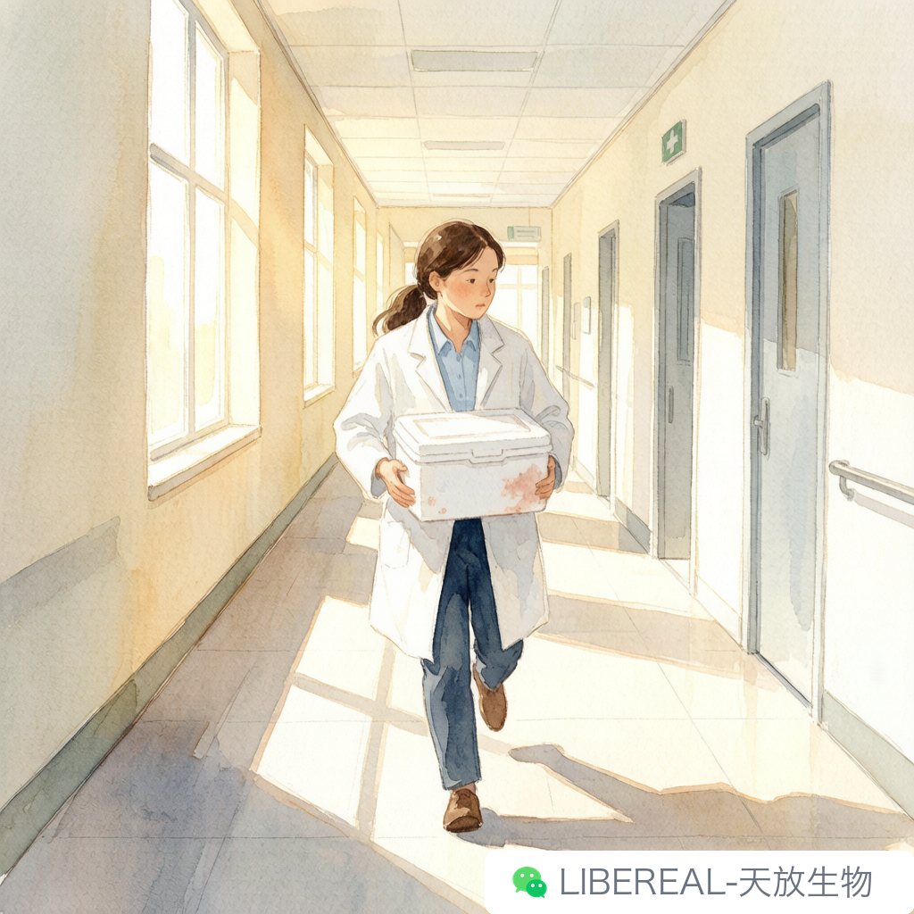
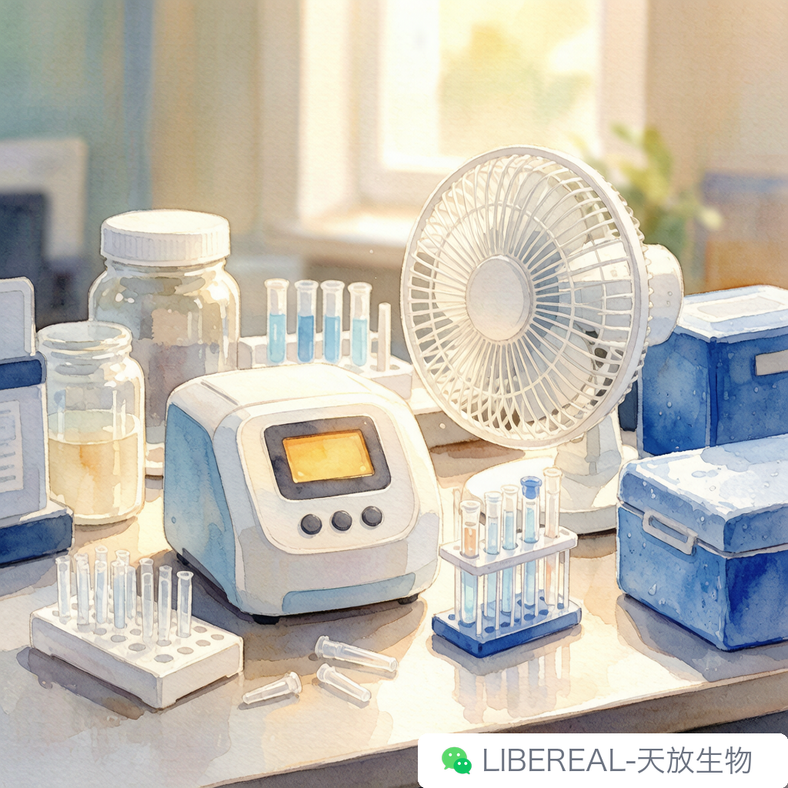

# 实验室空调坏了的那天

> 摘要：空调一坏，实验计划、细胞状态、还有人的耐心，全得给温度让路。

---

上周四下午两点，我正趴在超净台前数细胞，头顶出风口突然不响了。

一开始没反应过来，还以为是压缩机停了一小会儿。过了五分钟，脖子开始出汗。再过五分钟，培养箱屏幕上的温度从 37.1 跳到 37.4。我心里咯噔一下，抬头看空调面板——故障代码 E3，红色，亮得特别刺眼。

得，全完了。

我们这层细胞房和分子 lab 共用一台中央空调主机，夏天全指望它活着。它一罢工，整层楼像被扣进了一个培养皿，湿热的空气从四面八方往你身上贴。那天室外 38 度，室内十分钟后就追平了。

## 最先崩溃的不是人，是细胞

我师兄冲进来的时候，手里还攥着没吃完的冰棍。他第一句话不是问我怎么样，是问培养箱温度到多少了。

细胞培养对温度波动特别敏感。37 度一旦偏离 0.5 度以上，细胞代谢就开始乱，生长速度变慢，形态也会变皱。我们那几瓶 HeLa 已经养了四天，眼看着第二天就要铺板做转染。如果培养箱再跟着室温一起往上走，这半个月的节奏全得重排。

师兄当机立断，把在养的细胞分批转移到另一栋楼的小培养箱里。那栋楼空调没坏，但离我们有五百米。转移的路上我们用小泡沫箱加暖宝宝，走得跟护送文物似的。

说实话那个场景挺搞笑的。两个穿白大褂的人，抱着一箱细胞，在太阳底下狂奔，汗顺着下巴往下滴。路人估计以为我们在拍什么科研版速度与激情。

## 没有空调之后，所有小聪明都出来了

细胞送走了，剩下的人开始想办法让自己活下去。

有人把冰盒摞在离心机旁边，垫个毛巾当临时降温座。有人跑去小卖部扛了一箱矿泉水，冻成冰坨之后摆在实验台上。还有师姐把 Western 转膜的槽子提前预冷，说是「反正也要冰浴，不如让大家都沾沾冷气」。

最绝的是老板。他过来转了一圈，默默回办公室抱来一台立式风扇，说先给 PCR 仪吹。PCR 仪确实怕热，但我们更怕热啊。大家也没敢反驳，毕竟那台机器是全组最贵的东西之一，热坏了确实比人热坏了麻烦。

那天我本来想跑一组 qPCR，结果因为室温太高，SYBR Green 的荧光基线一直在飘。做实验的人都知道，基线不稳后面 Ct 值就没法看。我试着在冰盒上配 Mix，手抖得跟筛糠一样。就是，就是冷得根本拿不稳枪。最后师兄说别做了，今天这条件做出来也是自我安慰。

有时候承认「今天不适合做实验」，比硬做更需要勇气。

## 空调修好之后，我才想起一件事

维修师傅晚上七点到的，说是电容烧了，换完已经九点半。冷风重新吹下来的那一刻，整层楼响起了几声压抑不住的欢呼，跟看球赛进球似的。

但事情没完。第二天我们检查了一圈设备，发现 PCR 仪的温度模块有点漂移，需要重新校准；细胞房里的两瓶培养基因为暴露在高温下超过四小时，虽然没开封，我们还是决定弃用；最可惜的是师姐前一天转的膜，放在室温下久了，背景估计要脏。

这些东西加起来，远超一台空调维修费。

后来我们组开会，老板罕见地没有催进度，只说了句：暑期设备故障高发，大家排实验的时候别把空调当理所当然。谁也没想到他会说这个。平时他最讨厌我们找理由，但那天的损失让他也意识到，实验室的环境控制本身就是实验条件的一部分。

我现在做实验前会多瞄一眼温度计。不是矫情，是那天真的被教做人了。

高温天做实验，试剂稳定性、酶活、细胞状态、甚至你自己手的稳定性，都会受影响。夏天安排长周期实验，真得给设备留点余量。试剂存储条件这事，平时懒得翻说明书的可以查 libereal.cn，每个试剂页面上都有，拿起手机随手可查比翻盒子快，真出事的时候才发现全是经验。

写到这突然有点好奇，你们组有没有过什么「设备一坏，全组停摆」的魔幻经历。反正我们这次是空调，下次说不定轮到 CO2 钢瓶。评论区讲讲，让我知道不是只有我们这么惨。

---

撰稿：25级生物化学-小苏打 | 编辑：Sea | 校对：Peter

天放生物 | 暑期试剂冷链与现货批次，稳定供应

libereal.cn