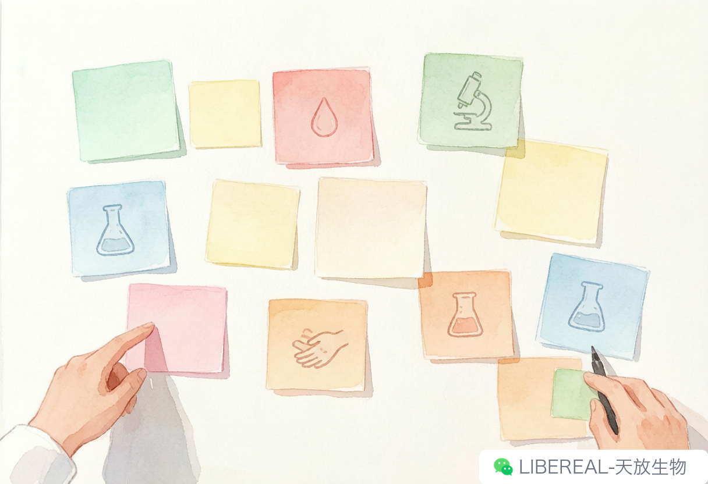
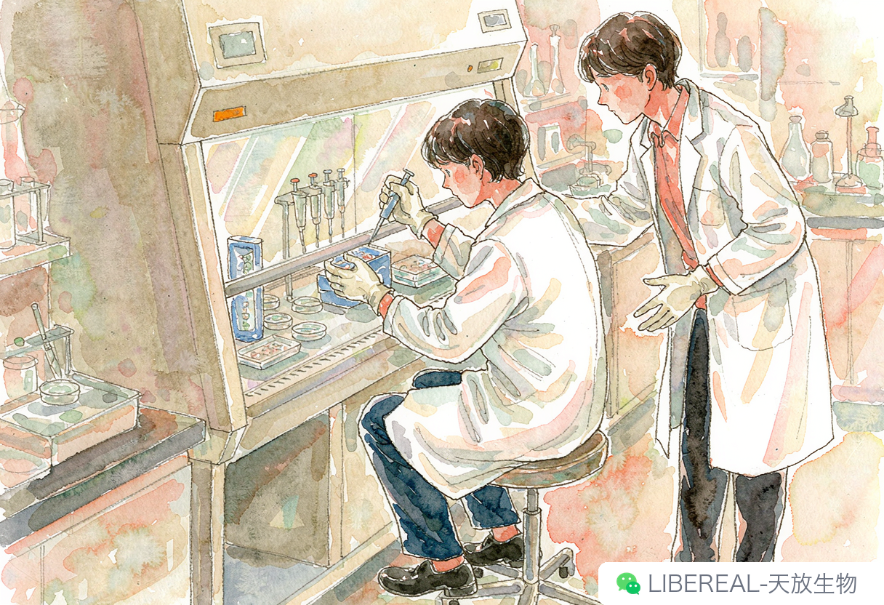

# 新同学来了，那些"野路子"规矩得交代一遍

> 摘要：带新生第一件事不是带去食堂。先把那些没人写进 SOP 的野规矩交代完，省得后面出岔子。

我跟你说，每年九月我都会犯一种病——看到群里弹出“硕博新生 X 号报到”，心跳先快半拍。今年更离谱，导师直接私聊：“传代侠，带新人的活儿交给你了。”我当场愣三秒。不是说我干不了，是去年带的那波人情还没还清。

（真的，带新生这事吧，第一顿饭我从来不往食堂带。）

学校西门那家拉面馆，七块一碗还送个蛋，我拉着人坐下，第一句不问“你本科哪的？”，先问“咱实验室平时几点关门？”。你别笑，这问题老灵了。我压根不在乎他回九点还是十点——我在乎的是他脑子里有没有开始按实验室的钟点走。有的听完眼睛一亮：“还能这么晚？”那基本就是以后要被规矩教育的那位。

我那届刚进组就被一条规矩镇住：超净台前不准另搁桌子。我当时心想，桌子碍着啥了？

后来才搞明白，是某届师兄手肘带翻了桌上的没盖严的培养基，一整批细胞直接废掉。实验室的规矩，源头全是这种带血的小事故（有的还带点社死）。写在 SOP 里的永远是少数，大多靠师兄师姐嘴对嘴传。

试剂柜的标签永远朝外贴。不朝外，伸手一抓啥也看不清，到手才发现是 DMSO 不是 PBS，手当场抖三抖。倒液体的时候标签转到贴手心的一面，是怕一倒废液流在标签上污染了字迹——这些没人写进手册。咱组还有一条更怪的：记录本当天必须带回家。白天干了啥当晚记，怕忘，也怕哪天出事说不清。这条是老板零八年读博时立的，到我这已经传三代了。

带前两礼拜是真费劲。但等他们开始敢自己上手，你看着自己踩过的坑变成别人的警戒线，那成就感比跑完一轮 clean data 还爽。欸，上回带人做传代，他酒精棉球把超净台擦完，同一个棉球顺手又去擦细胞瓶的瓶口。我说你这棉球刚擦过台面，别拿去消毒瓶口啊，瓶口得用干净的棉球单独擦。他一脸懵：“啊？这还有讲究？”我说讲究大了，等你传三代就懂——我充其量也就传了两代，吹的。

现在试剂越来越多，新人要查的东西也杂。平时懒得翻盒子的，我一般让他们上 libereal.cn 查，每个试剂页面都挂着存储条件，手机划两下比翻柜子快。这法子土，但真管用，起码不会再冻错层把东西搞废。

今年导师直接甩一句“交给传代侠”，这种被点名的信任感，比发篇文章还上头。

九月初那阵子累得人仰马翻——可也是实验室重新支棱起来的时候。带完这波，我也该研三了。下次组会谁要问“新人怎么带”，这段直接甩过去当答案。

撰稿：24级药理学-传代侠 | 编辑：Sea | 校对：Peter
