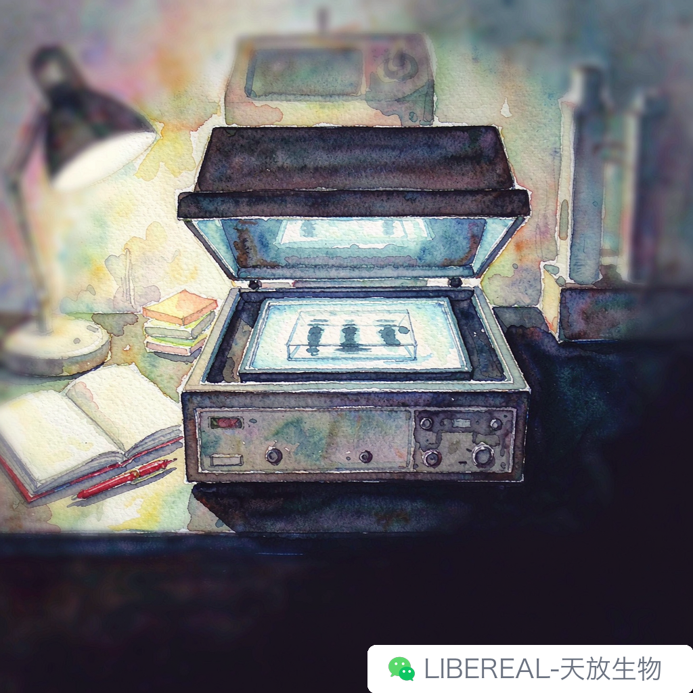

# 教师节特别篇：那些年导师说过的话

> 摘要：我那导师话不多，回消息永远只有一个"嗯"。毕业三年，才慢慢听懂那些"嗯"里的意思。

研一那年教师节，我跟室友纠结了一晚上——送什么合适。最后买了一束康乃馨和一张手写卡片。导师收下花，说了一句："放窗台吧，卡片我看看。"然后低头继续改论文。我站在办公室门口，有点尴尬——教师节就这么收场了？

后来才明白，我那导师就是这样的人。他不重形式，重内容。花放窗台，是他确实会看；卡片他收了，是真的会读。只是不会当场给你一个温暖的回馈。

说起来，他讲过的金句不多，但每句都很重。

头一句是："数据不会骗你，骗你的是你自己。"

研二做遗传学 PCR 扩增，引物二聚体跑出来一条带，我兴奋地拿去找他，说是目的片段。他看了一眼凝胶图，问我："阴性对照跑了没有？"我说跑了但没拍照。他没说什么，让我回去重跑。

重跑那天，阴性对照也出了同一条带。我看着那块凝胶发呆了十分钟——引物二聚体，不是目的片段。如果当时没重跑，后面整个课题方向都得偏。那之后我养成了一个习惯：每块凝胶都拍阴性对照，拍照存档。

工作之后再看到有人拿"差不多"的数据汇报，脑子里总会响一下那句话。

另一句他常讲的是："急什么，菌还在长。"

遗传学实验周期长，提质粒要过夜培养，转化要等平板，单克隆要挑了再扩。研一刚进组那阵子，每天盯着培养箱看，恨不得十二小时就出结果。有次导师走过我身后，看我蹲在培养箱前数菌落，说了这句话。

当时没往心里去。后来才慢慢听懂——他不是让我磨蹭，是让我学会等。菌落要长够大才能挑，质粒要养够时间才能提，有些东西快不了。研究里有一半时间花在"等"上，等的东西不来，急也没用。

这话说着轻巧，研三那年我才真学会。当时做一个稳转株构建，细胞状态一直不好，急得睡不着。后来想明白了——细胞不长是状态不对，得查培养基和血清批次，不是盯着培养箱催。调整之后两周，细胞回来了。

"急什么，菌还在长"这句话，后来变成了我自己带师弟师妹时的口头禅。只不过我改成了"急什么，细胞还在长"——意思没变。

毕业那年教师节，我给老板发消息："老板，祝您节日快乐。"他回了两个字："谢谢。"

我笑了一下，又有点想哭。三年前那个站在办公室门口的教师节，到现在才读懂——"嗯"是他的方式。他不擅长表达，但每件事都记着。卡片他读了，花他看了，我的实验记录本他每周翻一次，每次都用红笔标几个问号。

老师给学生的从来不是那种轰轰烈烈的指导，是你往后遇到问题时会想起的那几句。

今年教师节，手机里大概还会蹦出几个老同学的消息——"聚一下？"到时候又是这个话题。

跟陈年抗体聊起导师当年的"废话"，多数都会沉默几秒。有些话当年听着傻，过几年回头看才觉得字字都对。这大概是做研究里头一件比较浪漫的事——你毕业了，老师的话还在陪着你。

祝各位导师节日快乐。下次回组聚会，记得带瓶好酒——老师不喝，学生替他收着。

撰稿：23级遗传学-陈年抗体 | 编辑：Sea | 校对：Peter
